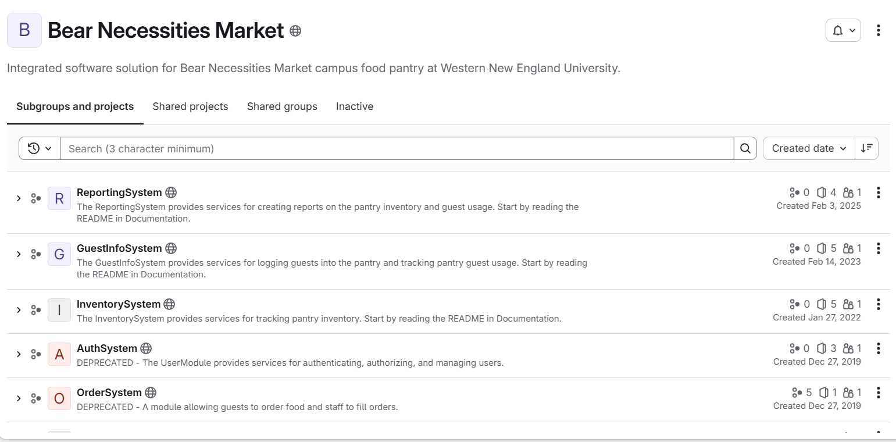

[← Back to Portfolio](/portfolio/){: .btn .btn--info}

{: .align-center width="600px"}

Bear Necessities Market Inventory and Guest Information System is a legacy Java application inherited each year by the senior Computer Science class of Western New England University. The application was designed to help the campus food pantry manage customer visit records and track inventory. The class conducted an interview with the product owner to determine changes and fixes desired within the application. With the initial interview conducted, the class broke into several teams to work on various parts of the project. The team of 5 I was assigned to decided to work within the project infrastructure, in particular, a solution to maintaining the out of date dependencies. During sprint 1, our team's main objective was to find a tool that could scan the dependencies within each product and compare the current version with the newest version. After a few days of research, we found that the tool Renovate Runner would perform our desired tasks perfectly.

## My Role

I led the integration of Renovate Runner across Bear Necessities Market's sub-projects, taking ownership of how dependencies were tracked and kept current across the codebase. This meant learning Renovate Runner's tooling and configuration from documentation and AI, then figuring out how to apply it consistently across multiple interconnected sub-projects without breaking existing functionality. This proved to be a real balancing act between staying current on dependencies and maintaining stability for other teams.

## Challenges

The biggest challenge at first was coordinating dependency updates across sub-projects in a way that didn't introduce breaking changes. With dozens of people working in parallel, an update that looked safe in isolation could easily conflict with work happening elsewhere. I knew our team had to build a process for testing and rolling out updates carefully, while also getting up to speed on a tool I hadn't used before. To combat this challenge, I suggested we open a test environment to implement Renovate Runner so as to not allow any unknown breaking changes. With this new test environment, the implementation of the Renovate bot went much smoother for the remaining sprints.

## Working in Agile

The team operated using an Agile workflow, with regular check-ins and iterative development. Our team would conduct morning meetings where we discussed what we did in the past 24 hours, what we planned on doing in the next 24 hours, and anything we might have had trouble with. This opened a dialogue to ask for help from any peers or request clarification. Additionally, we participated in multiple cross-team meetings, communicating and asking questions with teams working on completely different aspects of the project. Finally, at the start of each week, we completed surveys from the project manager regarding our work in the past week and what we aimed to achieve in the upcoming week as well. This was a very good introduction to how dependency management and team coordination work together in a real software project, not just a solo assignment.

## Takeaways

This project gave me hands-on experience with a piece of the development process that's easy to overlook in coursework: keeping a multi-part codebase's dependencies current and stable over time. It's a skill that translates directly to real-world software maintenance, not just building something once and walking away. Additionally, the opportunity of working within an agile team that communicates frequently will always be a valuable experience I will draw on in many future projects I will work on.
