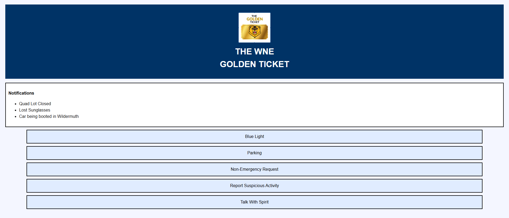

[← Back to Portfolio](/portfolio/){: .btn .btn--info}
{: .align-center width="600px"}

The Campus Security and Information App is a project built around a full Human-Computer Interaction (HCI) design process. The project's purpose was aimed at giving students an easier way to report security incidents, concerns and request safety escorts from campus police. The app would also present campus information to students produced by campus safety officers. This information includes parking statuses, building closures and more. Additionally, from the campus safety officer user perspective, the requests made by students would be added into a ticketing system that would then be organized by urgency and assigned to campus safety officers. As team lead of a 4 person group, I guided the project from initial research through to a working HTML prototype, working closely with campus police as the primary stakeholders throughout.

## My Role

As team lead, I was responsible for keeping the team's design decisions grounded in real stakeholder needs while still pushing for a system that was genuinely usable for students. That meant running stakeholder interviews with campus police early on to understand how they currently handled incident reports and escort requests, then translating what we learned into a design the team could actually build and test. Additionally, interviews were held with student users to determine needs from their perspective.

## Design Process

The team followed a full HCI design cycle rather than jumping straight into building. We started by developing user personas and mapping out student journeys, covering a multitude of situations from noticing a security concern or needing an escort, to actually getting help — helping us identify where the current process broke down. From there, we built wireframes and iterated on them based on stakeholder feedback, refining the interface across multiple rounds before arriving at a working HTML prototype. We then ran usability testing sessions to see how real users interacted with the design, using what we learned to make further adjustments before finalizing the prototype.

## Challenges

The biggest challenge was balancing stakeholder needs with usability. Campus police had specific requirements for the information they needed to receive and how incident data needed to be structured on their end, but a design built purely around those needs risked being clunky or intimidating for a student trying to quickly report a concern. As team lead, I had to keep both sides in view — pushing back on complexity where it hurt usability, while making sure the system still gave police the information they actually needed to respond effectively.

## Takeaways

This project was my first real experience leading a team through a formal design process from research to prototype, and it taught me how much of good software design happens before a single line of code is written. Balancing the needs of two very different user groups, including students in a moment of concern and police who need clear, actionable information, was a genuinely useful exercise in the kind of trade-offs real product design requires.
